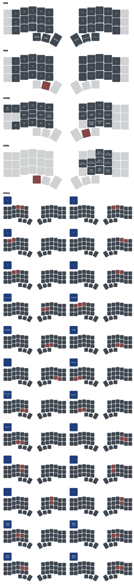
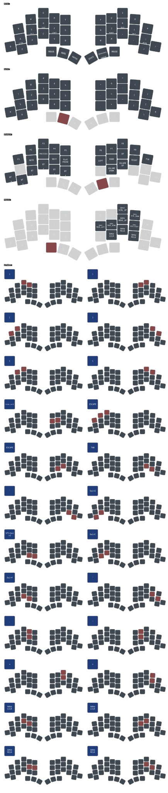
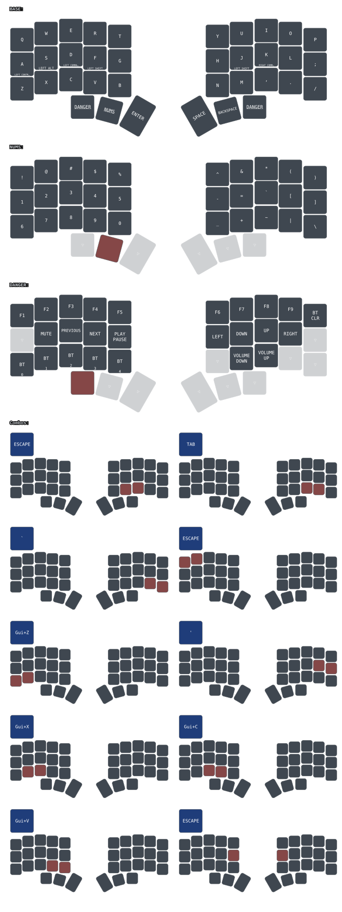
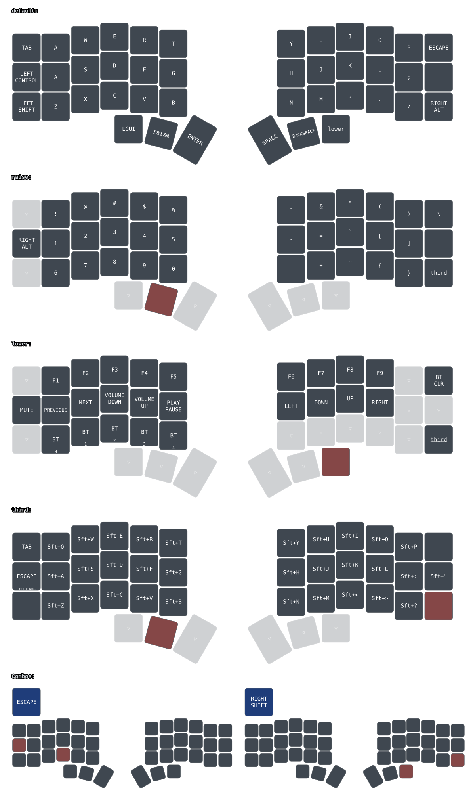

# ZMK Config - Keyboard Layouts

This repository contains ZMK firmware configurations for various keyboards with visual keymap representations.

## Keyboard Layouts
### Corne

### Totem

### Chipper

### Chippy

