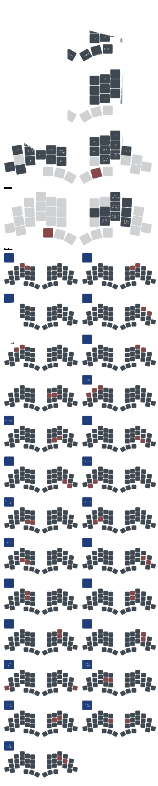

# ZMK Config - Keyboard Layouts

This repository contains ZMK firmware configurations for various keyboards with visual keymap representations.

## Keyboard Layouts
### Corne

### Totem

### Chipper

### Chippy

## Files

- Configuration files are located in the `config/` directory
- Visual keymap representations are generated using [@keymap-drawer](https://github.com/caksoylar/keymap-drawer) and stored in `keymap-drawer/`
